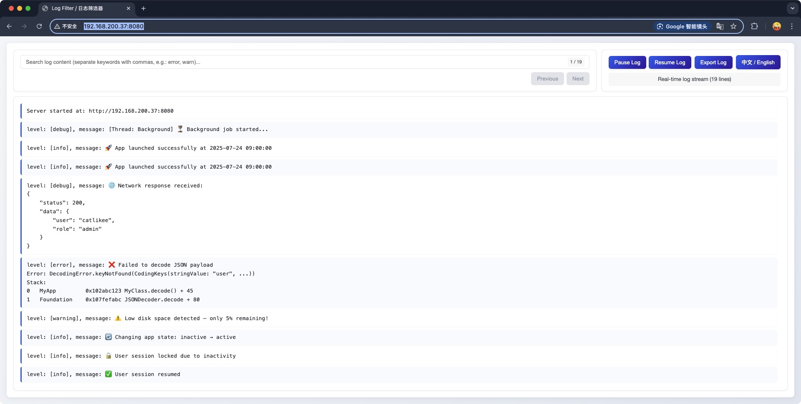

# SwiftLogX

  

SwiftLogX is a powerful Swift logging framework that not only captures and redirects `NSLog` output but also provides a convenient web interface for real-time viewing and management of your application's logs in a browser. Additionally, it offers an `#xlog` macro for easy custom log recording in your code.

**Compatibility:** Swift 5.9+, iOS 14.0+, macOS 13.0+

## Features

*   **NSLog Redirection**: Automatically captures and processes `NSLog` output.
*   **Real-time Web Logging**: View application logs in real-time through a built-in HTTP server in your browser.
*   **Log Search and Filtering**: The web interface supports searching and filtering log content.
*   **Log Export**: Supports exporting cached logs to a file.
*   **Custom Logging Macro**: Provides the `#xlog` macro to simplify logging operations.
*   **Lightweight**: Easy to integrate and use.

## Installation

### Swift Package Manager

Add the following dependency to your `Package.swift` file:

```swift
dependencies: [
    .package(url: "https://github.com/LikeeCat/SwiftLogX.git", from: "1.0.0")
]
```

Alternatively, in Xcode, go to `File > Add Packages...` and search for `SwiftLogX`.

## Usage

### 1. Initialize the Log Manager

Call `LogManager.shared.setup(port:)` at your application's launch (e.g., in `AppDelegate` or `SceneDelegate`) to initialize the logging service. You can optionally specify the port; the default is `9000`.

```swift
import SwiftLogX

func application(_ application: UIApplication, didFinishLaunchingWithOptions launchOptions: [UIApplication.LaunchOptionsKey: Any]?) -> Bool {
    // Use default port 9000
    LogManager.shared.setup()
    // Or specify a port, e.g., 8080
    // LogManager.shared.setup(port: 8080)
    return true
}
```

### 2. Log with the `#xlog` Macro

You can use the `#xlog` macro to record custom logs.

```swift
import SwiftLogXMacros // Import the macros module

// Log a string
#xlog("This is a custom log message.")

// Log a variable
let username = "Gemini"
#xlog("User \(username) logged in.")

// Log a complex object (ensure the object is printable)
struct MyData {
    let id: Int
    let name: String
}
let data = MyData(id: 1, name: "Test")
#xlog("Data object: \(data)")
```

### 3. Access the Web Log Interface

When your application runs, SwiftLogX starts a local HTTP server. You can find the server address in the console output, typically `http://<Your IP Address>:9000` or `http://localhost:9000`.

Open this address in your browser to access the real-time log interface.

### 4. Example

Here's a simple example demonstrating how to integrate SwiftLogX into your application and record logs:



```swift
import UIKit
import SwiftLogX
import SwiftLogXMacros // Import the macros module

class ViewController: UIViewController {

    override func viewDidLoad() {
        super.viewDidLoad()

        // Initialize the logging service (usually done in AppDelegate)
        // LogManager.shared.setup()

        // Log some messages
        NSLog("This is a standard NSLog message.")
        #xlog("This is a message logged via the #xlog macro.")

        DispatchQueue.main.asyncAfter(deadline: .now() + 2) {
            NSLog("NSLog message sent after 2 seconds.")
            #xlog("#xlog message sent after 2 seconds.")
        }

        Timer.scheduledTimer(withTimeInterval: 5.0, repeats: true) { _ in
            #xlog("Timer message sent every 5 seconds. Current time: \(Date())")
        }
    }
}

```
---

# SwiftLogX

SwiftLogX 是一个强大的 Swift 日志框架，它不仅能够捕获和重定向 `NSLog` 输出，还提供了一个便捷的 Web 界面，让您可以在浏览器中实时查看和管理应用程序的日志。此外，它还提供了一个 `#xlog` 宏，方便您在代码中进行自定义日志记录。

## 特性

*   **NSLog 重定向**: 自动捕获 `NSLog` 输出并进行处理。
*   **实时 Web 日志**: 通过内置的 HTTP 服务器，在浏览器中实时查看应用程序日志。
*   **日志搜索与过滤**: Web 界面支持日志内容的搜索和过滤功能。
*   **日志导出**: 支持将缓存的日志导出为文件。
*   **自定义日志宏**: 提供 `#xlog` 宏，简化日志记录操作。
*   **轻量级**: 易于集成和使用。

## 安装

### Swift Package Manager

在您的 `Package.swift` 文件中添加以下依赖：

```swift
dependencies: [
    .package(url: "https://github.com/LikeeCat/SwiftLogX.git", from: "1.0.0")
]
```

或者在 Xcode 中，通过 `File > Add Packages...` 搜索并添加 `SwiftLogX`。

## 使用方法

### 1. 初始化日志管理器

在您的应用程序启动时（例如 `AppDelegate` 或 `SceneDelegate` 中），调用 `LogManager.shared.setup(port:)` 来初始化日志服务。您可以选择指定端口，默认为 `9000`。

```swift
import SwiftLogX

func application(_ application: UIApplication, didFinishLaunchingWithOptions launchOptions: [UIApplication.LaunchOptionsKey: Any]?) -> Bool {
    // 使用默认端口 9000
    LogManager.shared.setup()
    // 或者指定端口，例如 8080
    // LogManager.shared.setup(port: 8080)
    return true
}
```

### 2. 使用 `#xlog` 宏记录日志

您可以使用 `#xlog` 宏来记录自定义日志。

```swift
import SwiftLogXMacros // 导入宏模块

// 记录字符串
#xlog("这是一条自定义日志消息。")

// 记录变量
let username = "Gemini"
#xlog("用户 \(username) 已登录。")

// 记录复杂对象 (需要确保对象可被打印)
struct MyData {
    let id: Int
    let name: String
}
let data = MyData(id: 1, name: "Test")
#xlog("数据对象: \(data)")
```

### 3. 访问 Web 日志界面

当您的应用程序运行时，SwiftLogX 会启动一个本地 HTTP 服务器。您可以在控制台输出中找到服务器的地址，通常是 `http://<您的IP地址>:9000` 或 `http://localhost:9000`。

在浏览器中打开该地址，即可访问实时日志界面。

### 4. 示例

以下是一个简单的示例，展示了如何在应用程序中集成 SwiftLogX 并记录日志：


```swift
import UIKit
import SwiftLogX
import SwiftLogXMacros // 导入宏模块

class ViewController: UIViewController {

    override func viewDidLoad() {
        super.viewDidLoad()

        // 初始化日志服务 (通常在 AppDelegate 中完成)
        // LogManager.shared.setup()

        // 记录一些日志
        NSLog("这是一个标准的 NSLog 消息。")
        #xlog("这是一条通过 #xlog 宏记录的消息。")

        DispatchQueue.main.asyncAfter(deadline: .now() + 2) {
            NSLog("2秒后发送的 NSLog 消息。")
            #xlog("2秒后发送的 #xlog 消息。")
        }

        Timer.scheduledTimer(withTimeInterval: 5.0, repeats: true) { _ in
            #xlog("每5秒发送一次的定时器消息。当前时间: \(Date())")
        }
    }
}
```

